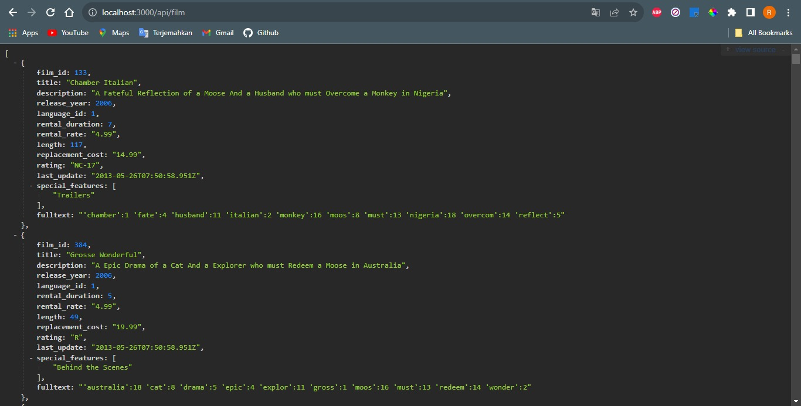

# HWExpressJS

Nama : Rizki Rifani (FSWD 5A)

Program ini akan berjalan di port sesuai dengan yang ditentukan (misalnya, port 3000). Program dapat diakses dengn endpoint-endpoint berikut:

- Untuk menampilkan semua actor: `http://localhost:3000/api/actor`
- Untuk menampilkan semua film: `http://localhost:3000/api/film`
- Untuk menampilkan film tertentu berdasarkan ID: `http://localhost:3000/api/film/{film_id}`
- Untuk menampilkan semua kategori: `http://localhost:3000/api/categories`
- Untuk menampilkan film berdasarkan kategori: `http://localhost:3000/api/film/category/{nama_kategori}`

Pada program ini terdiri dari 4 File utama yaitu :
- Index.js
  
File ini merupakan file untuk menjalankan keseluruhan program
- Db.js

File ini merupakan file untuk menghubungkan ke database
- Router.js

File ini merupakan file untuk melakukan pemanggilan fungsi dari file Query yang nantinya setiap endpoint diakses
- Query.js

File ini merupakan file yang melakukan proses mendapatkan data dari database dengan menggunakan command sql

Adapun juga beberap folder yang berisi file yaitu :
- Seeding
  
Pada folder ini berisi file seed yang berfungsi untuk melakukan penambahan data dengan query  sql ke database
- Migration

Pada folder ini berisi migration yang berfungsi untuk melakukan proses update ke database


## Persyaratan

Sebelum dapat menjalankan aplikasi, pastikan telah memenuhi persyaratan berikut:

- Node.js
- PostgreSQL
- Browser
- Postman

## Instalasi

1. Clone repositori ini ke komputer:

   ```bash
   git clone https://github.com/rizkirifandi7/HW-ExpressJS.git

2. Pindah ke direktori projek

   ```bash
   cd HW-ExpressJS

3. Install depedensi atau module

   ```bash
   npm install

4. Import sample data `dvdrental.tar` ke database PostgreSQL

5. Proses selesai

## Demo Program

1. Masukkan endpoint berikut ke dalam url browser untuk menampilkan semua actor:

   ```bash
   http://localhost:3000/api/actor

Maka akan muncul seperti berikut:


2. Masukkan endpoint berikut ke dalam url browser untuk menampilkan semua list film:

   ```bash
   http://localhost:3000/api/film

Maka akan muncul seperti berikut:



3. Masukkan endpoint berikut ke dalam url browser untuk menampilkan film tertentu berdasarkan id:

- `http://localhost:3000/api/film/{film_id}`
- Contoh 
   ```bash
   http://localhost:3000/api/film/1

Maka akan muncul seperti berikut:


4. Masukkan endpoint berikut ke dalam url browser untuk menampilkan semua list kategori:

   ```bash
   http://localhost:3000/api/categories

Maka akan muncul seperti berikut:


5. Masukkan endpoint berikut ke dalam url browser Untuk menampilkan film berdasarkan kategori:

- `http://localhost:3000/api/film/category/{nama_kategori}`
- Contoh:
   ```bash
   http://localhost:3000/api/film/category/Horror

Maka akan muncul seperti berikut:


